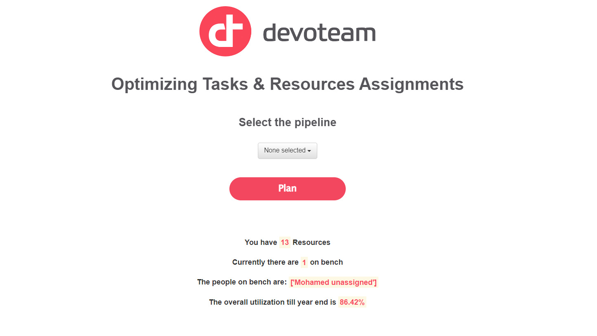
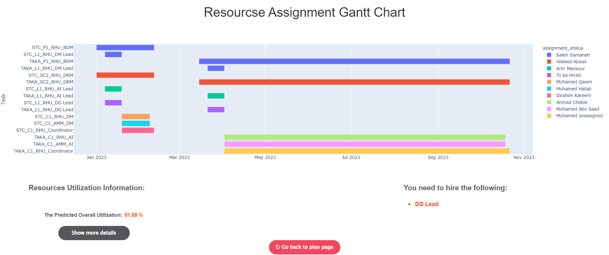

# Resources Assignment Tool

## **Description**

This project is a POC of resource assignment optimization tool which is
used to optimize the resources assignments process in IT companies in
which all resources (employees) in the company can be employed and
aligned efficiently with the appropriate tasks & roles for the upcoming
projects in the company according to their skills, seniority and
utilization factor in addition of providing hiring suggestion for the
tasks that require unavailable resources.

## **Project Files Structure**

    data
    ├── ongoing_projects.xlsx
    ├── Resources_sheet.xlsx
    ├── STC_effort_sizing.xlsx
    ├── TAKA_effort_sizing.xlsx
    static
    ├── bootstrap-multiselect.css
    ├── bootstrap-multiselect.js
    ├── devoteam-logo.png
    ├── style.css
    templates
    ├── base.html
    ├── dashboard.html
    ├── home.html
    .gitignore
    generic_resource_kpis.py
    main.py
    parse_effort_sizing.py
    parse_ongoing_resources.py
    README.md
    resources_KPIs.py
    run_optimization.py
    utils.py

## Installation instructions

**1- Create a new environment**

-   open `cmd` in the project directory.

-   run the following commands to create an environment directory :

-   `mkdir env`

-   create environment by python

-   `python -m venv env/devoteam_ra`


**2-activate the environment to start libraries\packages installation**

-   `env\devoteam_ra\Scripts\activate`

-   output :

``` python
>> (devoteam_ra) C:\Github Projects\resource_assignment-main>
```

**`Note:`** to deactivate the environment just run `deactivate` (`Don't do it for now`)

**3- Install the required libraries & packages from `requirements.txt`
file**

run the following command on cmd after activating the environment
`devoteam_ra` :

-   `pip install -r requirements.txt`

## Usage

-   To run the tool please make sure you are still in the same
    environment

-   run in `cmd` : `python main.py`

``` python
>> 
""" 
WARNING: This is a development server. Do not use it in a production deployment. Use a production WSGI server instead.
    * Running on http://127.0.0.1:8080
Press CTRL+C to quit
""" 
```

-   copy & paste [`http://127.0.0.1:8080`](http://127.0.0.1:8080) in
    your browser to show the running tool.



-   select the `pipeline` and click on `"optimize"` to get the following
    GanttChart

    

## Contributors

-   Amr Mansour

-   Mohamad Osman

-   Ahmad Cheble

## The End
